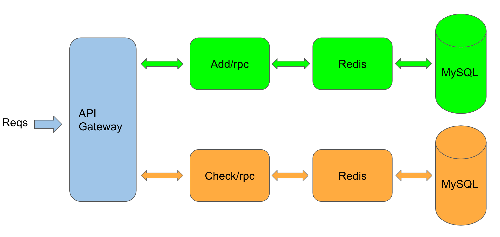
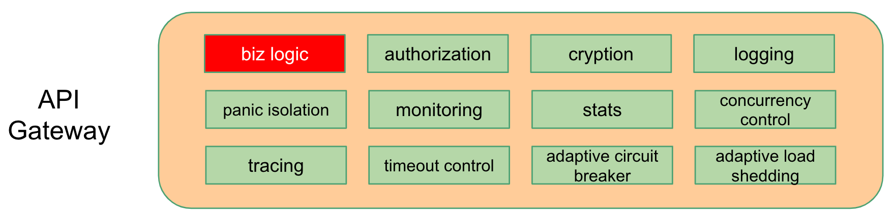
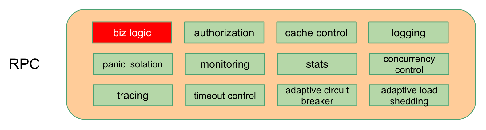
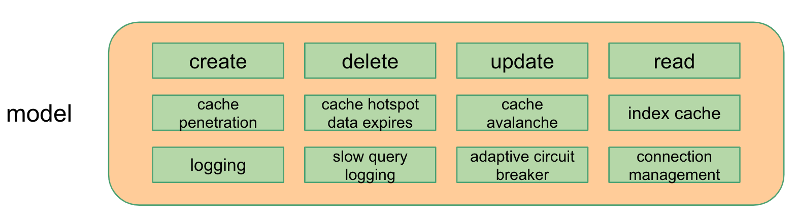
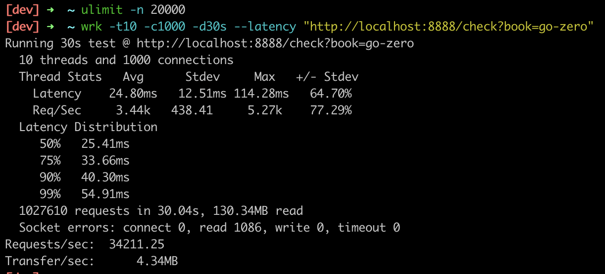

# Rapid development of microservices - multiple RPCs

English | [简体中文](bookstore.md)

## 0. Why building microservices are so difficult

To build a well working microservice, we need lots of knowledges from different aspects.

* basic functionalities
  1. concurrency control and rate limit, to avoid being brought down by unexpected inbound
  2. service discovery, make sure new or terminated nodes are detected asap
  3. load balancing, balance the traffic base on the throughput of nodes
  4. timeout control, avoid the nodes continue to process the timed out requests
  5. circuit breaker, load shedding, fail fast, protects the failure nodes to recover asap

* advanced functionalities
  1. authorization, make sure users can only access their own data
  2. tracing, to understand the whole system and locate the specific problem quickly
  3. logging, collects data and helps to backtrace problems
  4. observability, no metrics, no optimization

For any point listed above, we need a long article to describe the theory and the implementation. But for us, the developers, it’s very difficult to understand all the concepts and make it happen in our systems. Although, we can use the frameworks that have been well served busy sites. [go-zero](https://github.com/tal-tech/go-zero) is born for this purpose, especially for cloud-native microservice systems.

As well, we always adhere to the idea that **prefer tools over conventions and documents**. We hope to reduce the boilerplate code as much as possible, and let developers focus on developing the business related code. For this purpose, we developed the tool  `goctl`.

Let’s take the shorturl microservice as a quick example to demonstrate how to quickly create microservices by using [go-zero](https://github.com/tal-tech/go-zero). After finishing this tutorial, you’ll find that it’s so easy to write microservices!

## 1. What is a bookstore service

For simplicity, the bookstore service only contains two functionalities, adding books and quering prices.

Writting this bookstore service is to demonstrate the complete flow of creating a microservice by using go-zero. But algorithms and detail implementations are quite simplified, and this bookstore service is not suitable for production use.

## 2. Architecture of shorturl microservice



## 3. goctl generated code overview

All modules with green background are generated, and will be enabled when necessary. The modules with red background are handwritten code, which is typically business logic code.

* API Gateway

  

* RPC

  

* model

  

And now, let’s walk through the complete flow of quickly create a microservice with go-zero.

## 4. Get started

* install etcd, mysql, redis

* install protoc-gen-go

  ```shell
  go get -u github.com/golang/protobuf/protoc-gen-go
  ```

* install goctl

  ```shell
  GO111MODULE=on go get -u github.com/tal-tech/go-zero/tools/goctl
  ```

* create the working dir `bookstore` and `bookstore/api`

* in `bookstore` dir, execute `go mod init bookstore` to initialize `go.mod``

## 5. Write code for API Gateway

* use goctl to generate `api/bookstore.api`

  ```Plain Text
  goctl api -o bookstore.api
  ```

  for simplicity, the leading `info` block is removed, and the code looks like:

  ```go
  type (
      addReq struct {
          book  string `form:"book"`
          price int64  `form:"price"`
      }
  
      addResp struct {
          ok bool `json:"ok"`
      }
  )
  
  type (
      checkReq struct {
          book string `form:"book"`
      }
  
      checkResp struct {
          found bool  `json:"found"`
          price int64 `json:"price"`
      }
  )
  
  service bookstore-api {
      @server(
          handler: AddHandler
      )
      get /add(addReq) returns(addResp)
  
      @server(
          handler: CheckHandler
      )
      get /check(checkReq) returns(checkResp)
  }
  ```

  the usage of `type` keyword is the same as that in go, service is used to define get/post/head/delete api requests, described below:

  * `service bookstore-api { defines the service name
  * `@server` defines the properties that used in server side
  * `handler` defines the handler name
  * `get /add(addReq) returns(addResp)` defines this is a GET request, the request parameters, and the response parameters

* generate the code for API Gateway by using goctl

  ```shell
  goctl api go -api bookstore.api -dir .
  ```

  the generated file structure looks like:

  ```Plain Text
  api
  ├── bookstore.api                  // api definition
  ├── bookstore.go                   // main entrance
  ├── etc
  │   └── bookstore-api.yaml         // configuration file
  └── internal
      ├── config
      │   └── config.go              // configuration definition
      ├── handler
      │   ├── addhandler.go          // implements addHandler
      │   ├── checkhandler.go        // implements checkHandler
      │   └── routes.go              // routes definition
      ├── logic
      │   ├── addlogic.go            // implements AddLogic
      │   └── checklogic.go          // implements CheckLogic
      ├── svc
      │   └── servicecontext.go      // defines ServiceContext
      └── types
          └── types.go               // defines request/response
  ```

* start API Gateway service, listens on port 8888 by default

  ```shell
  go run bookstore.go -f etc/bookstore-api.yaml
  ```

* test API Gateway service

  ```shell
  curl -i "http://localhost:8888/check?book=go-zero"
  ```

  response like:

  ```http
  HTTP/1.1 200 OK
  Content-Type: application/json
  Date: Thu, 03 Sep 2020 06:46:18 GMT
  Content-Length: 25
  
  {"found":false,"price":0}
  ```

  You can see that the API Gateway service did nothing except returned a zero value. And let’s implement the business logic in rpc service.

* you can modify `internal/svc/servicecontext.go` to pass dependencies if needed

* implement logic in package `internal/logic`

* you can use goctl to generate code for clients base on the .api file

* till now, the client engineer can work with the api, don’t need to wait for the implementation of server side

## 6. Write code for add rpc service

- under directory `bookstore` create dir `rpc`

* under directory `rpc/add` create `add.proto` file

  ```shell
  goctl rpc template -o add.proto
  ```
  
  edit the file and make the code looks like:

  ```protobuf
  syntax = "proto3";
  
  package add;
  
  message addReq {
      string book = 1;
      int64 price = 2;
  }
  
  message addResp {
      bool ok = 1;
  }
  
  service adder {
      rpc add(addReq) returns(addResp);
  }
  ```
  
* use goctl to generate the rpc code, execute the following command in `rpc/add`

  ```shell
  goctl rpc proto -src add.proto
  ```

  the generated file structure looks like:

  ```Plain Text
  rpc/add
  ├── add.go                      // rpc main entrance
  ├── add.proto                   // rpc definition
  ├── adder
  │   ├── adder.go                // defines how rpc clients call this service
  │   ├── adder_mock.go           // mock file, for test purpose
  │   └── types.go                // request/response definition
  ├── etc
  │   └── add.yaml                // configuration file
  ├── internal
  │   ├── config
  │   │   └── config.go           // configuration definition
  │   ├── logic
  │   │   └── addlogic.go         // add logic here
  │   ├── server
  │   │   └── adderserver.go      // rpc handler
  │   └── svc
  │       └── servicecontext.go   // defines service context, like dependencies
  └── pb
      └── add.pb.go
  ```

just run it, looks like:

```shell
  $ go run add.go -f etc/add.yaml
  Starting rpc server at 127.0.0.1:8080...
```

you can change the listening port in file `etc/add.yaml`.

## 7. Write code for check rpc service

* under directory `rpc/check` create `check.proto` file

  ```shell
  goctl rpc template -o check.proto
  ```
  
  edit the file and make the code looks like:

  ```protobuf
  syntax = "proto3";
  
  package check;
  
  message checkReq {
      string book = 1;
  }
  
  message checkResp {
      bool found = 1;
      int64 price = 2;
  }
  
  service checker {
      rpc check(checkReq) returns(checkResp);
  }
  ```
  
* use goctl to generate the rpc code, execute the following command in `rpc/check`

  ```shell
  goctl rpc proto -src check.proto
  ```

  the generated file structure looks like:

  ```Plain Text
  rpc/check
  ├── check.go                    // rpc main entrance
  ├── check.proto                 // rpc definition
  ├── checker
  │   ├── checker.go              // defines how rpc clients call this service
  │   ├── checker_mock.go         // mock file, for test purpose
  │   └── types.go                // request/response definition
  ├── etc
  │   └── check.yaml              // configuration file
  ├── internal
  │   ├── config
  │   │   └── config.go           // configuration definition
  │   ├── logic
  │   │   └── checklogic.go       // check logic here
  │   ├── server
  │   │   └── checkerserver.go    // rpc handler
  │   └── svc
  │       └── servicecontext.go   // defines service context, like dependencies
  └── pb
      └── check.pb.go
  ```

  you can change the listening port in `etc/check.yaml`.

  we need to change the port in `etc/check.yaml` to `8081`, because `8080` is used by `add` service.

  just run it, looks like:
  
  ```shell
  $ go run check.go -f etc/check.yaml
  Starting rpc server at 127.0.0.1:8081...
  ```

## 8. Modify API Gateway to call add/check rpc service

* modify the configuration file `bookstore-api.yaml`, add the following:

  ```yaml
  Add:
    Etcd:
      Hosts:
        - localhost:2379
      Key: add.rpc
  Check:
    Etcd:
      Hosts:
        - localhost:2379
      Key: check.rpc
  ```

  automatically discover the add/check service by using etcd.

* modify the file `internal/config/config.go`, add dependency on add/check service:

  ```go
  type Config struct {
      rest.RestConf
      Add   zrpc.RpcClientConf     // manual code
      Check zrpc.RpcClientConf     // manual code
  }
  ```

* modify the file `internal/svc/servicecontext.go`, like below:

  ```go
  type ServiceContext struct {
      Config  config.Config
      Adder   adder.Adder          // manual code
      Checker checker.Checker      // manual code
  }
  
  func NewServiceContext(c config.Config) *ServiceContext {
      return &ServiceContext{
          Config:  c,
          Adder:   adder.NewAdder(zrpc.MustNewClient(c.Add)),         // manual code
          Checker: checker.NewChecker(zrpc.MustNewClient(c.Check)),   // manual code
      }
  }
  ```

  passing the dependencies among services within ServiceContext.

* modify the method `Add` in the file `internal/logic/addlogic.go`, looks like:

  ```go
  func (l *AddLogic) Add(req types.AddReq) (*types.AddResp, error) {
      // manual code start
      resp, err := l.svcCtx.Adder.Add(l.ctx, &adder.AddReq{
          Book:  req.Book,
          Price: req.Price,
      })
      if err != nil {
          return nil, err
      }
  
      return &types.AddResp{
          Ok: resp.Ok,
      }, nil
      // manual code stop
  }
  ```

  by calling the method `Add` of `adder` to add books into bookstore.

* modify the file `internal/logic/checklogic.go`, looks like:

  ```go
  func (l *CheckLogic) Check(req types.CheckReq) (*types.CheckResp, error) {
      // manual code start
      resp, err := l.svcCtx.Checker.Check(l.ctx, &checker.CheckReq{
          Book:  req.Book,
      })
      if err != nil {
          return nil, err
      }
  
      return &types.CheckResp{
          Found: resp.Found,
          Price: resp.Price,
      }, nil
      // manual code stop
  }
  ```

  by calling the method `Check` of `checker` to check the prices from the bookstore.

Till now, we’ve done the modification of API Gateway. All the manually added code are marked.

## 9. Define the database schema, generate the code for CRUD+cache

* under bookstore, create the directory `rpc/model`: `mkdir -p rpc/model`

* under the directory rpc/model create the file called `book.sql`, contents as below:

  ```sql
  CREATE TABLE `book`
  (
    `book` varchar(255) NOT NULL COMMENT 'book name',
    `price` int NOT NULL COMMENT 'book price',
    PRIMARY KEY(`book`)
  ) ENGINE=InnoDB DEFAULT CHARSET=utf8mb4;
  ```

* create DB and table

  ```sql
  create database gozero;
  ```

  ```sql
  source book.sql;
  ```

* under the directory `rpc/model` execute the following command to genrate CRUD+cache code, `-c` means using `redis cache`

  ```shell
  goctl model mysql ddl -c -src book.sql -dir .
  ```

  you can also generate the code from the database url by using `datasource` subcommand instead of `ddl`

  the generated file structure looks like:

  ```Plain Text
  rpc/model
  ├── bookstore.sql
  ├── bookstoremodel.go     // CRUD+cache code
  └── vars.go               // const and var definition
  ```

## 10. Modify add/check rpc to call crud+cache

* modify `rpc/add/etc/add.yaml`, add the following:

  ```yaml
  DataSource: root:@tcp(localhost:3306)/gozero
  Table: book
  Cache:
    - Host: localhost:6379
  ```

  you can use multiple redis as cache. redis node and cluster are both supported.

* modify `rpc/add/internal/config.go`, like below:

  ```go
  type Config struct {
      zrpc.RpcServerConf
      DataSource string             // manual code
      Table      string             // manual code
      Cache      cache.CacheConf    // manual code
  }
  ```

  added the configuration for mysql and redis cache.

* modify `rpc/add/internal/svc/servicecontext.go` and `rpc/check/internal/svc/servicecontext.go`, like below:

  ```go
  type ServiceContext struct {
      c     config.Config
      Model *model.BookModel   // manual code
  }
  
  func NewServiceContext(c config.Config) *ServiceContext {
      return &ServiceContext{
          c:             c,
          Model: model.NewBookModel(sqlx.NewMysql(c.DataSource), c.Cache, c.Table), // manual code
      }
  }
  ```

* modify `rpc/add/internal/logic/addlogic.go`, like below:

  ```go
  func (l *AddLogic) Add(in *add.AddReq) (*add.AddResp, error) {
      // manual code start
      _, err := l.svcCtx.Model.Insert(model.Book{
          Book:  in.Book,
          Price: in.Price,
      })
      if err != nil {
          return nil, err
      }
  
      return &add.AddResp{
          Ok: true,
      }, nil
      // manual code stop
  }
  ```

* modify `rpc/check/internal/logic/checklogic.go`, like below:

  ```go
  func (l *CheckLogic) Check(in *check.CheckReq) (*check.CheckResp, error) {
      // manual code start
      resp, err := l.svcCtx.Model.FindOne(in.Book)
      if err != nil {
          return nil, err
      }
  
      return &check.CheckResp{
          Found: true,
          Price: resp.Price,
      }, nil
      // manual code stop
  }
  ```
  
  till now, we finished modifing the code, all the modified code is marked.

## 11. Call shorten and expand services

* call add api

  ```shell
  curl -i "http://localhost:8888/add?book=go-zero&price=10"
  ```

  response like:

  ```http
  HTTP/1.1 200 OK
  Content-Type: application/json
  Date: Thu, 03 Sep 2020 09:42:13 GMT
  Content-Length: 11
  
  {"ok":true}
  ```

* call check api

  ```shell
  curl -i "http://localhost:8888/check?book=go-zero"
  ```

  response like:

  ```http
  HTTP/1.1 200 OK
  Content-Type: application/json
  Date: Thu, 03 Sep 2020 09:47:34 GMT
  Content-Length: 25
  
  {"found":true,"price":10}
  ```

## 12. Benchmark

Because benchmarking the write requests depends on the write throughput of mysql, we only benchmarked the check api. We read the data from mysql and cache it in redis. For simplicity, I only check one book, because of cache, the effect is the same for multiple books.

Before benchmark, we need to change the max open files:

```shel
ulimit -n 20000
```

And change the log level to error, to avoid too many logs affect the benchmark. Add the following in every yaml file:

```yaml
Log:
	Level: error
```



as shown above, in my MacBook Pro, the QPS is like 30K+.

## 13. Full code

[https://github.com/tal-tech/go-zero/tree/master/example/bookstore](https://github.com/tal-tech/go-zero/tree/master/example/bookstore)

## 14. Conclusion

We always adhere to **prefer tools over conventions and documents**.

go-zero is not only a framework, but also a tool to simplify and standardize the building of micoservice systems.

We not only keep the framework simple, but also encapsulate the complexity into the framework. And the developers are free from building the difficult and boilerplate code. Then we get the rapid development and less failure.

For the generated code by goctl, lots of microservice components are included, like concurrency control, adaptive circuit breaker, adaptive load shedding, auto cache control etc. And it’s easy to deal with the busy sites.

If you have any ideas that can help us to improve the productivity, tell me any time! 👏
