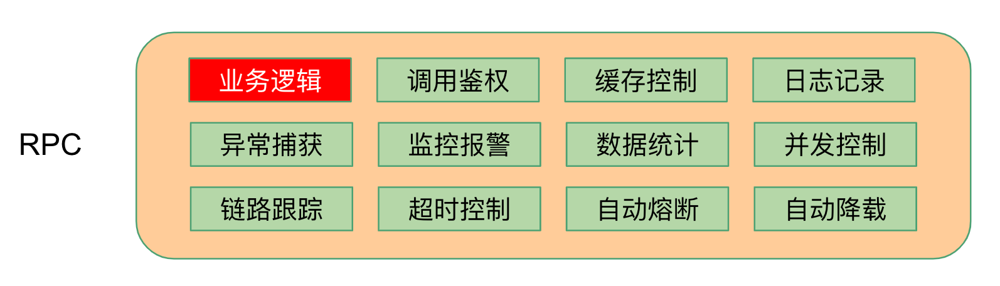

# 快速构建微服务-多RPC版

[English](bookstore-en.md) | 简体中文

## 0. 为什么说做好微服务很难

要想做好微服务，我们需要理解和掌握的知识点非常多，从几个维度上来说：

* 基本功能层面
  1. 并发控制&限流，避免服务被突发流量击垮
  2. 服务注册与服务发现，确保能够动态侦测增减的节点
  3. 负载均衡，需要根据节点承受能力分发流量
  4. 超时控制，避免对已超时请求做无用功
  5. 熔断设计，快速失败，保障故障节点的恢复能力

* 高阶功能层面
  1. 请求认证，确保每个用户只能访问自己的数据
  2. 链路追踪，用于理解整个系统和快速定位特定请求的问题
  3. 日志，用于数据收集和问题定位
  4. 可观测性，没有度量就没有优化

对于其中每一点，我们都需要用很长的篇幅来讲述其原理和实现，那么对我们后端开发者来说，要想把这些知识点都掌握并落实到业务系统里，难度是非常大的，不过我们可以依赖已经被大流量验证过的框架体系。[go-zero微服务框架](https://github.com/tal-tech/go-zero)就是为此而生。

另外，我们始终秉承**工具大于约定和文档**的理念。我们希望尽可能减少开发人员的心智负担，把精力都投入到产生业务价值的代码上，减少重复代码的编写，所以我们开发了`goctl`工具。

下面我通过书店服务来演示通过[go-zero](https://github.com/tal-tech/go-zero)快速的创建微服务的流程，走完一遍，你就会发现：原来编写微服务如此简单！

## 1. 书店服务示例简介

为了教程简单，我们用书店服务做示例，并且只实现其中的增加书目和检查价格功能。

写此书店服务是为了从整体上演示go-zero构建完整微服务的过程，实现细节尽可能简化了。

## 2. 书店微服务架构图


## 3. goctl各层代码生成一览

所有绿色背景的功能模块是自动生成的，按需激活，红色模块是需要自己写的，也就是增加下依赖，编写业务特有逻辑，各层示意图分别如下：

* API Gateway

  

* RPC

  

* model

  

下面我们来一起完整走一遍快速构建微服务的流程，Let’s `Go`!🏃‍♂️

## 4. 准备工作

* 安装etcd, mysql, redis

* 安装`protoc-gen-go`

  ```shell
  go get -u github.com/golang/protobuf/protoc-gen-go
  ```

* 安装goctl工具

  ```shell
  GO111MODULE=on GOPROXY=https://goproxy.cn/,direct go get -u github.com/tal-tech/go-zero/tools/goctl
  ```

* 创建工作目录 `bookstore` 和 `bookstore/api`

* 在`bookstore`目录下执行`go mod init bookstore`初始化`go.mod`

## 5. 编写API Gateway代码

* 在`bookstore/api`目录下通过goctl生成`api/bookstore.api`：

  ```bash
  goctl api -o bookstore.api
  ```

  编辑`bookstore.api`，为了简洁，去除了文件开头的`info`，代码如下：

  ```go
  type (
      addReq struct {
          book  string `form:"book"`
          price int64  `form:"price"`
      }
  
      addResp struct {
          ok bool `json:"ok"`
      }
  )
  
  type (
      checkReq struct {
          book string `form:"book"`
      }
  
      checkResp struct {
          found bool  `json:"found"`
          price int64 `json:"price"`
      }
  )
  
  service bookstore-api {
      @server(
          handler: AddHandler
      )
      get /add(addReq) returns(addResp)
  
      @server(
          handler: CheckHandler
      )
      get /check(checkReq) returns(checkResp)
  }
  ```

  type用法和go一致，service用来定义get/post/head/delete等api请求，解释如下：

  * `service bookstore-api {`这一行定义了service名字
  * `@server`部分用来定义server端用到的属性
  * `handler`定义了服务端handler名字
  * `get /add(addReq) returns(addResp)`定义了get方法的路由、请求参数、返回参数等

* 使用goctl生成API Gateway代码

  ```shell
  goctl api go -api bookstore.api -dir .
  ```

  生成的文件结构如下：

  ```Plain Text
  api
  ├── bookstore.api                  // api定义
  ├── bookstore.go                   // main入口定义
  ├── etc
  │   └── bookstore-api.yaml         // 配置文件
  └── internal
      ├── config
      │   └── config.go              // 定义配置
      ├── handler
      │   ├── addhandler.go          // 实现addHandler
      │   ├── checkhandler.go        // 实现checkHandler
      │   └── routes.go              // 定义路由处理
      ├── logic
      │   ├── addlogic.go            // 实现AddLogic
      │   └── checklogic.go          // 实现CheckLogic
      ├── svc
      │   └── servicecontext.go      // 定义ServiceContext
      └── types
          └── types.go               // 定义请求、返回结构体
  ```

* 启动API Gateway服务，默认侦听在8888端口

  ```shell
  go run bookstore.go -f etc/bookstore-api.yaml
  ```

* 测试API Gateway服务

  ```shell
  curl -i "http://localhost:8888/check?book=go-zero"
  ```

  返回如下：

  ```http
  HTTP/1.1 200 OK
  Content-Type: application/json
  Date: Thu, 03 Sep 2020 06:46:18 GMT
  Content-Length: 25
  
  {"found":false,"price":0}
  ```

  可以看到我们API Gateway其实啥也没干，就返回了个空值，接下来我们会在rpc服务里实现业务逻辑

* 可以修改`internal/svc/servicecontext.go`来传递服务依赖（如果需要）

* 实现逻辑可以修改`internal/logic`下的对应文件

* 可以通过`goctl`生成各种客户端语言的api调用代码

* 到这里，你已经可以通过goctl生成客户端代码给客户端同学并行开发了，支持多种语言，详见文档

## 6. 编写add rpc服务

- 在 `bookstore` 下创建 `rpc` 目录

* 在`rpc/add`目录下编写`add.proto`文件

  可以通过命令生成proto文件模板

  ```shell
  goctl rpc template -o add.proto
  ```

  修改后文件内容如下：

  ```protobuf
  syntax = "proto3";
  
  package add;
  
  message addReq {
      string book = 1;
      int64 price = 2;
  }
  
  message addResp {
      bool ok = 1;
  }
  
  service adder {
      rpc add(addReq) returns(addResp);
  }
  ```

* 用`goctl`生成rpc代码，在`rpc/add`目录下执行命令

  ```shell
  goctl rpc proto -src add.proto
  ```

  文件结构如下：

  ```Plain Text
  rpc/add
  ├── add.go                      // rpc服务main函数
  ├── add.proto                   // rpc接口定义
  ├── adder
  │   ├── adder.go                // 提供了外部调用方法，无需修改
  │   ├── adder_mock.go           // mock方法，测试用
  │   └── types.go                // request/response结构体定义
  ├── etc
  │   └── add.yaml                // 配置文件
  ├── internal
  │   ├── config
  │   │   └── config.go           // 配置定义
  │   ├── logic
  │   │   └── addlogic.go         // add业务逻辑在这里实现
  │   ├── server
  │   │   └── adderserver.go      // 调用入口, 不需要修改
  │   └── svc
  │       └── servicecontext.go   // 定义ServiceContext，传递依赖
  └── pb
      └── add.pb.go
  ```

直接可以运行，如下：

```shell
  $ go run add.go -f etc/add.yaml
  Starting rpc server at 127.0.0.1:8080...
```

`etc/add.yaml`文件里可以修改侦听端口等配置

## 7. 编写check rpc服务

* 在`rpc/check`目录下编写`check.proto`文件

  可以通过命令生成proto文件模板

  ```shell
  goctl rpc template -o check.proto
  ```

  修改后文件内容如下：

  ```protobuf
  syntax = "proto3";
  
  package check;
  
  message checkReq {
      string book = 1;
  }
  
  message checkResp {
      bool found = 1;
      int64 price = 2;
  }
  
  service checker {
      rpc check(checkReq) returns(checkResp);
  }
  ```

* 用`goctl`生成rpc代码，在`rpc/check`目录下执行命令

  ```shell
  goctl rpc proto -src check.proto
  ```

  文件结构如下：

  ```Plain Text
  rpc/check
  ├── check.go                    // rpc服务main函数
  ├── check.proto                 // rpc接口定义
  ├── checker
  │   ├── checker.go              // 提供了外部调用方法，无需修改
  │   ├── checker_mock.go         // mock方法，测试用
  │   └── types.go                // request/response结构体定义
  ├── etc
  │   └── check.yaml              // 配置文件
  ├── internal
  │   ├── config
  │   │   └── config.go           // 配置定义
  │   ├── logic
  │   │   └── checklogic.go       // check业务逻辑在这里实现
  │   ├── server
  │   │   └── checkerserver.go    // 调用入口, 不需要修改
  │   └── svc
  │       └── servicecontext.go   // 定义ServiceContext，传递依赖
  └── pb
      └── check.pb.go
  ```

  `etc/check.yaml`文件里可以修改侦听端口等配置

  需要修改`etc/check.yaml`的端口为`8081`，因为`8080`已经被`add`服务使用了，直接可以运行，如下：

  ```shell
  $ go run check.go -f etc/check.yaml
  Starting rpc server at 127.0.0.1:8081...
  ```

## 8. 修改API Gateway代码调用add/check rpc服务

* 修改配置文件`bookstore-api.yaml`，增加如下内容

  ```yaml
  Add:
    Etcd:
      Hosts:
        - localhost:2379
      Key: add.rpc
  Check:
    Etcd:
      Hosts:
        - localhost:2379
      Key: check.rpc
  ```

  通过etcd自动去发现可用的add/check服务

* 修改`internal/config/config.go`如下，增加add/check服务依赖

  ```go
  type Config struct {
      rest.RestConf
      Add   zrpc.RpcClientConf     // 手动代码
      Check zrpc.RpcClientConf     // 手动代码
  }
  ```

* 修改`internal/svc/servicecontext.go`，如下：

  ```go
  type ServiceContext struct {
      Config  config.Config
      Adder   adder.Adder          // 手动代码
      Checker checker.Checker      // 手动代码
  }
  
  func NewServiceContext(c config.Config) *ServiceContext {
      return &ServiceContext{
          Config:  c,
          Adder:   adder.NewAdder(zrpc.MustNewClient(c.Add)),         // 手动代码
          Checker: checker.NewChecker(zrpc.MustNewClient(c.Check)),   // 手动代码
      }
  }
  ```

  通过ServiceContext在不同业务逻辑之间传递依赖

* 修改`internal/logic/addlogic.go`里的`Add`方法，如下：

  ```go
  func (l *AddLogic) Add(req types.AddReq) (*types.AddResp, error) {
      // 手动代码开始
      resp, err := l.svcCtx.Adder.Add(l.ctx, &adder.AddReq{
          Book:  req.Book,
          Price: req.Price,
      })
      if err != nil {
          return nil, err
      }
  
      return &types.AddResp{
          Ok: resp.Ok,
      }, nil
      // 手动代码结束
  }
  ```

  通过调用`adder`的`Add`方法实现添加图书到bookstore系统

* 修改`internal/logic/checklogic.go`里的`Check`方法，如下：

  ```go
  func (l *CheckLogic) Check(req types.CheckReq) (*types.CheckResp, error) {
      // 手动代码开始
      resp, err := l.svcCtx.Checker.Check(l.ctx, &checker.CheckReq{
          Book:  req.Book,
      })
      if err != nil {
          return nil, err
      }
  
      return &types.CheckResp{
          Found: resp.Found,
          Price: resp.Price,
      }, nil
      // 手动代码结束
  }
  ```

  通过调用`checker`的`Check`方法实现从bookstore系统中查询图书的价格

## 9. 定义数据库表结构，并生成CRUD+cache代码

* bookstore下创建`rpc/model`目录：`mkdir -p rpc/model`

* 在rpc/model目录下编写创建book表的sql文件`book.sql`，如下：

  ```sql
  CREATE TABLE `book`
  (
    `book` varchar(255) NOT NULL COMMENT 'book name',
    `price` int NOT NULL COMMENT 'book price',
    PRIMARY KEY(`book`)
  ) ENGINE=InnoDB DEFAULT CHARSET=utf8mb4;
  ```

* 创建DB和table

  ```sql
  create database gozero;
  ```

  ```sql
  source book.sql;
  ```

* 在`rpc/model`目录下执行如下命令生成CRUD+cache代码，`-c`表示使用`redis cache`

  ```shell
  goctl model mysql ddl -c -src book.sql -dir .
  ```

  也可以用`datasource`命令代替`ddl`来指定数据库链接直接从schema生成

  生成后的文件结构如下：

  ```Plain Text
  rpc/model
  ├── bookstore.sql
  ├── bookstoremodel.go     // CRUD+cache代码
  └── vars.go               // 定义常量和变量
  ```

## 10. 修改add/check rpc代码调用crud+cache代码

* 修改`rpc/add/etc/add.yaml`和`rpc/check/etc/check.yaml`，增加如下内容：

  ```yaml
  DataSource: root:@tcp(localhost:3306)/gozero
  Table: book
  Cache:
    - Host: localhost:6379
  ```

  可以使用多个redis作为cache，支持redis单点或者redis集群

* 修改`rpc/add/internal/config.go`和`rpc/check/internal/config.go`，如下：

  ```go
  type Config struct {
      zrpc.RpcServerConf
      DataSource string             // 手动代码
      Table      string             // 手动代码
      Cache      cache.CacheConf    // 手动代码
  }
  ```

  增加了mysql和redis cache配置

* 修改`rpc/add/internal/svc/servicecontext.go`和`rpc/check/internal/svc/servicecontext.go`，如下：

  ```go
  type ServiceContext struct {
      c     config.Config
      Model *model.BookModel   // 手动代码
  }
  
  func NewServiceContext(c config.Config) *ServiceContext {
      return &ServiceContext{
          c:             c,
          Model: model.NewBookModel(sqlx.NewMysql(c.DataSource), c.Cache, c.Table), // 手动代码
      }
  }
  ```

* 修改`rpc/add/internal/logic/addlogic.go`，如下：

  ```go
  func (l *AddLogic) Add(in *add.AddReq) (*add.AddResp, error) {
      // 手动代码开始
      _, err := l.svcCtx.Model.Insert(model.Book{
          Book:  in.Book,
          Price: in.Price,
      })
      if err != nil {
          return nil, err
      }
  
      return &add.AddResp{
          Ok: true,
      }, nil
      // 手动代码结束
  }
  ```

* 修改`rpc/check/internal/logic/checklogic.go`，如下：

  ```go
  func (l *CheckLogic) Check(in *check.CheckReq) (*check.CheckResp, error) {
      // 手动代码开始
      resp, err := l.svcCtx.Model.FindOne(in.Book)
      if err != nil {
          return nil, err
      }
  
      return &check.CheckResp{
          Found: true,
          Price: resp.Price,
      }, nil
      // 手动代码结束
  }
  ```
  
  至此代码修改完成，凡是手动修改的代码我加了标注

## 11. 完整调用演示

* add api调用

  ```shell
  curl -i "http://localhost:8888/add?book=go-zero&price=10"
  ```

  返回如下：

  ```http
  HTTP/1.1 200 OK
  Content-Type: application/json
  Date: Thu, 03 Sep 2020 09:42:13 GMT
  Content-Length: 11
  
  {"ok":true}
  ```

* check api调用

  ```shell
  curl -i "http://localhost:8888/check?book=go-zero"
  ```

  返回如下：

  ```http
  HTTP/1.1 200 OK
  Content-Type: application/json
  Date: Thu, 03 Sep 2020 09:47:34 GMT
  Content-Length: 25
  
  {"found":true,"price":10}
  ```

## 12. Benchmark

因为写入依赖于mysql的写入速度，就相当于压mysql了，所以压测只测试了check接口，相当于从mysql里读取并利用缓存，为了方便，直接压这一本书，因为有缓存，多本书也是一样的，对压测结果没有影响。

压测之前，让我们先把打开文件句柄数调大：

```shel
ulimit -n 20000
```

并日志的等级改为`error`，防止过多的info影响压测结果，在每个yaml配置文件里加上如下：

```yaml
Log:
	Level: error
```


可以看出在我的MacBook Pro上能达到3万+的qps。

## 13. 完整代码

[https://github.com/tal-tech/go-zero/tree/master/example/bookstore](https://github.com/tal-tech/go-zero/tree/master/example/bookstore)

## 14. 总结

我们一直强调**工具大于约定和文档**。

go-zero不只是一个框架，更是一个建立在框架+工具基础上的，简化和规范了整个微服务构建的技术体系。

我们在保持简单的同时也尽可能把微服务治理的复杂度封装到了框架内部，极大的降低了开发人员的心智负担，使得业务开发得以快速推进。

通过go-zero+goctl生成的代码，包含了微服务治理的各种组件，包括：并发控制、自适应熔断、自适应降载、自动缓存控制等，可以轻松部署以承载巨大访问量。

有任何好的提升工程效率的想法，随时欢迎交流！👏
