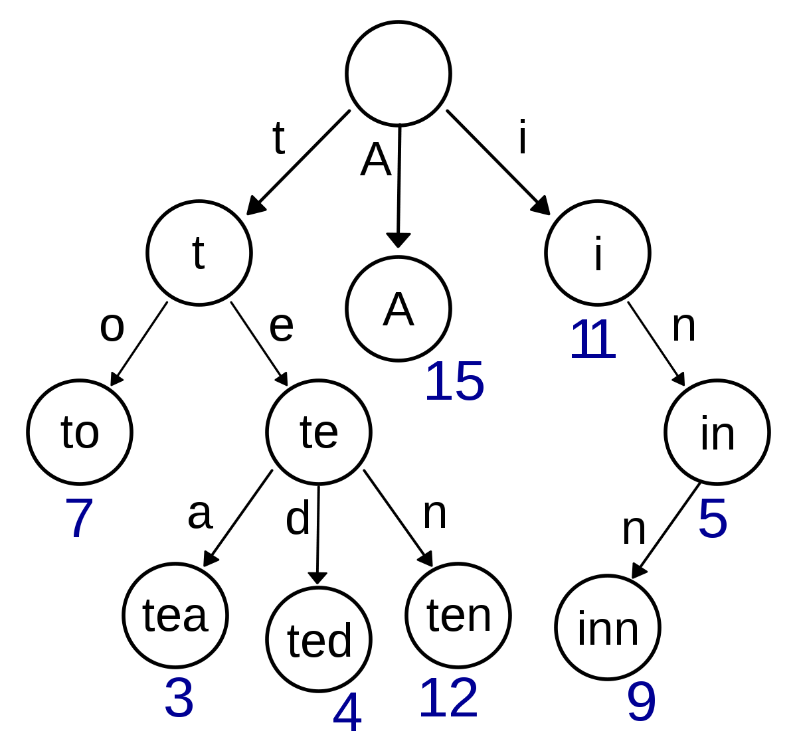

# 高效的关键词替换和敏感词过滤工具

## 1. 算法介绍

利用高效的Trie树建立关键词树，如下图所示，然后依次查找字符串中的相连字符是否形成树的一条路径



发现掘金上[这篇文章](https://juejin.im/post/6844903750490914829)写的比较详细，可以一读，具体原理在此不详述。

## 2. 关键词替换

支持关键词重叠，自动选用最长的关键词，代码示例如下：

```go
replacer := stringx.NewReplacer(map[string]string{
  "日本":    "法国",
  "日本的首都": "东京",
  "东京":    "日本的首都",
})
fmt.Println(replacer.Replace("日本的首都是东京"))
```

可以得到：

```Plain Text
东京是日本的首都
```

示例代码见`example/stringx/replace/replace.go`

## 3. 查找敏感词

代码示例如下：

```go
filter := stringx.NewTrie([]string{
  "AV演员",
  "苍井空",
  "AV",
  "日本AV女优",
  "AV演员色情",
})
keywords := filter.FindKeywords("日本AV演员兼电视、电影演员。苍井空AV女优是xx出道, 日本AV女优们最精彩的表演是AV演员色情表演")
fmt.Println(keywords)
```

可以得到：

```Plain Text
[苍井空 日本AV女优 AV演员色情 AV AV演员]
```

## 4. 敏感词过滤

代码示例如下：

```go
filter := stringx.NewTrie([]string{
  "AV演员",
  "苍井空",
  "AV",
  "日本AV女优",
  "AV演员色情",
}, stringx.WithMask('?')) // 默认替换为*
safe, keywords, found := filter.Filter("日本AV演员兼电视、电影演员。苍井空AV女优是xx出道, 日本AV女优们最精彩的表演是AV演员色情表演")
fmt.Println(safe)
fmt.Println(keywords)
fmt.Println(found)
```

可以得到：

```Plain Text
日本????兼电视、电影演员。?????女优是xx出道, ??????们最精彩的表演是??????表演
[苍井空 日本AV女优 AV演员色情 AV AV演员]
true
```

示例代码见`example/stringx/filter/filter.go`

## 5. Benchmark

| Sentences | Keywords | Regex    | go-zero |
| --------- | -------- | -------- | ------- |
| 10000     | 10000    | 16min10s | 27.2ms  |
