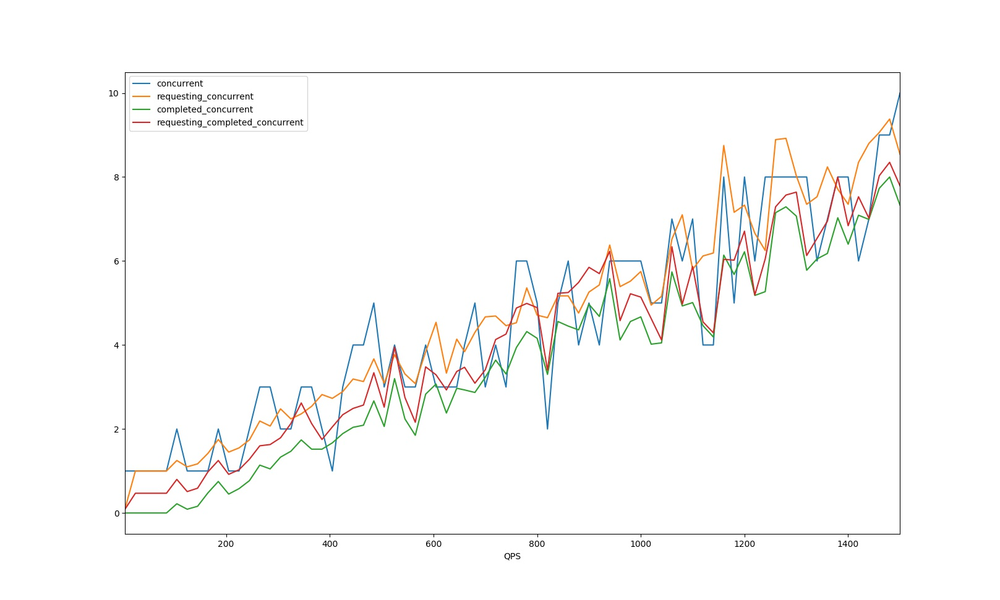

# 服务自适应降载保护设计

## 设计目的

* 保证系统不被过量请求拖垮
* 在保证系统稳定的前提下，尽可能提供更高的吞吐量

## 设计考虑因素

* 如何衡量系统负载
  * 是否处于虚机或容器内，需要读取cgroup相关负载
  * 用1000m表示100%CPU，推荐使用800m表示系统高负载
* 尽可能小的Overhead，不显著增加RT
* 不考虑服务本身所依赖的DB或者缓存系统问题，这类问题通过熔断机制来解决

## 机制设计

* 计算CPU负载时使用滑动平均来降低CPU负载抖动带来的不稳定，关于滑动平均见参考资料
  * 滑动平均就是取之前连续N次值的近似平均，N取值可以通过超参beta来决定
  * 当CPU负载大于指定值时触发降载保护机制
* 时间窗口机制，用滑动窗口机制来记录之前时间窗口内的QPS和RT(response time)
  * 滑动窗口使用5秒钟50个桶的方式，每个桶保存100ms时间内的请求，循环利用，最新的覆盖最老的
  * 计算maxQPS和minRT时需要过滤掉最新的时间没有用完的桶，防止此桶内只有极少数请求，并且RT处于低概率的极小值，所以计算maxQPS和minRT时按照上面的50个桶的参数只会算49个
* 满足以下所有条件则拒绝该请求
	1. 当前CPU负载超过预设阈值，或者上次拒绝时间到现在不超过1秒(冷却期)。冷却期是为了不能让负载刚下来就马上增加压力导致立马又上去的来回抖动
	2. `averageFlying > max(1, QPS*minRT/1e3)`
		* averageFlying = MovingAverage(flying)
		* 在算MovingAverage(flying)的时候，超参beta默认取值为0.9，表示计算前十次的平均flying值
		* 取flying值的时候，有三种做法：
			1. 请求增加后更新一次averageFlying，见图中橙色曲线
			2. 请求结束后更新一次averageFlying，见图中绿色曲线
			3. 请求增加后更新一次averageFlying，请求结束后更新一次averageFlying

			我们使用的是第二种，这样可以更好的防止抖动，如图：
			
		* QPS = maxPass * bucketsPerSecond
			* maxPass表示每个有效桶里的成功的requests
			* bucketsPerSecond表示每秒有多少个桶
		* 1e3表示1000毫秒，minRT单位也是毫秒，QPS*minRT/1e3得到的就是平均每个时间点有多少并发请求

## 降载的使用

* 已经在ngin和rpcx框架里增加了可选激活配置
  * CpuThreshold，如果把值设置为大于0的值，则激活该服务的自动降载机制
* 如果请求被drop，那么错误日志里会有`dropreq`关键字

## 参考资料

* [滑动平均](https://www.cnblogs.com/wuliytTaotao/p/9479958.html)
* [Sentinel自适应限流](https://github.com/alibaba/Sentinel/wiki/%E7%B3%BB%E7%BB%9F%E8%87%AA%E9%80%82%E5%BA%94%E9%99%90%E6%B5%81)
* [Kratos自适应限流保护](https://github.com/bilibili/kratos/blob/master/doc/wiki-cn/ratelimit.md)
