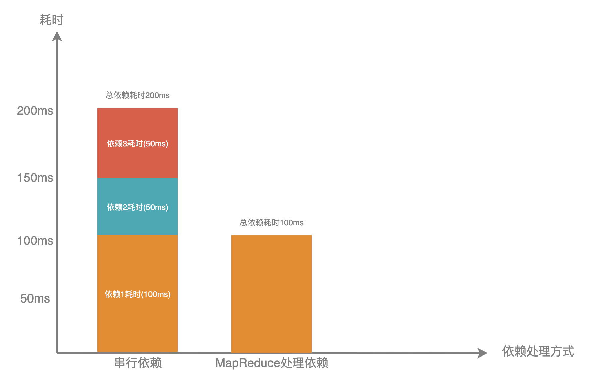
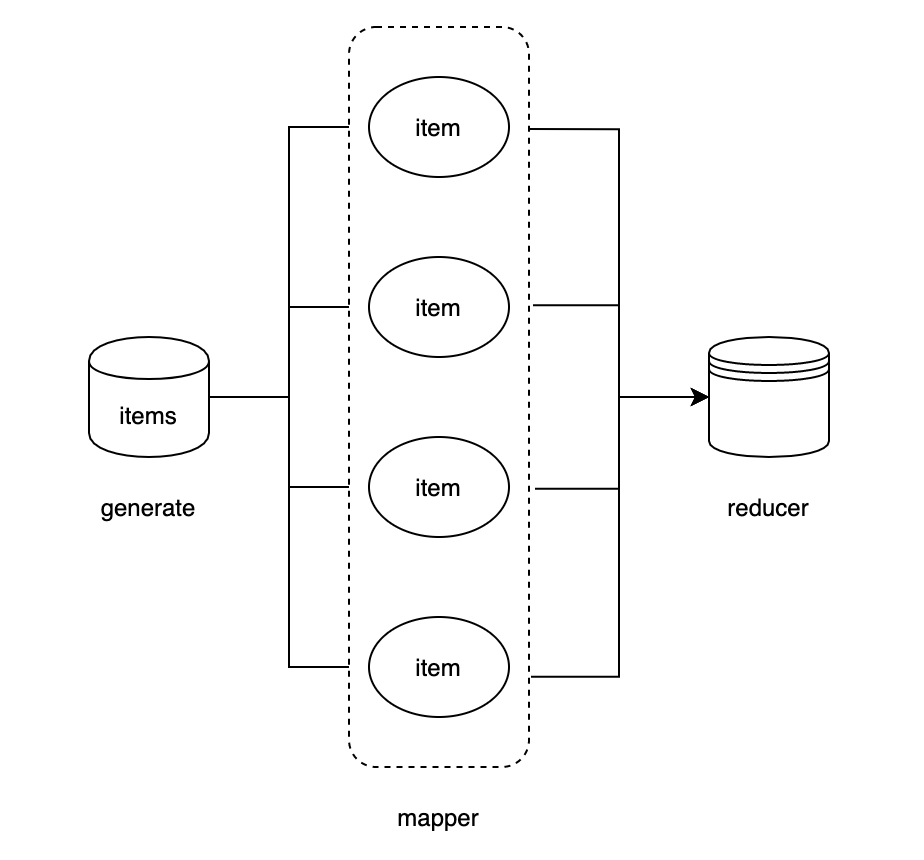

# 通过MapReduce降低服务响应时间

在微服务中开发中，api网关扮演对外提供restful api的角色，而api的数据往往会依赖其他服务，复杂的api更是会依赖多个甚至数十个服务。虽然单个被依赖服务的耗时一般都比较低，但如果多个服务串行依赖的话那么整个api的耗时将会大大增加。

那么通过什么手段来优化呢？我们首先想到的是通过并发来的方式来处理依赖，这样就能降低整个依赖的耗时，Go基础库中为我们提供了 [WaitGroup](https://golang.org/pkg/sync/#WaitGroup) 工具用来进行并发控制，但实际业务场景中多个依赖如果有一个出错我们期望能立即返回而不是等所有依赖都执行完再返回结果，而且WaitGroup中对变量的赋值往往需要加锁，每个依赖函数都需要添加Add和Done对于新手来说比较容易出错

基于以上的背景，go-zero框架中为我们提供了并发处理工具[MapReduce](https://github.com/tal-tech/go-zero/blob/master/core/mr/mapreduce.go)，该工具开箱即用，不需要做什么初始化，我们通过下图看下使用MapReduce和没使用的耗时对比:



相同的依赖，串行处理的话需要200ms，使用MapReduce后的耗时等于所有依赖中最大的耗时为100ms，可见MapReduce可以大大降低服务耗时，而且随着依赖的增加效果就会越明显，减少处理耗时的同时并不会增加服务器压力

## 并发处理工具[MapReduce](https://github.com/tal-tech/go-zero/tree/master/core/mr)

[MapReduce](https://zh.wikipedia.org/wiki/MapReduce)是Google提出的一个软件架构，用于大规模数据集的并行运算，go-zero中的MapReduce工具正是借鉴了这种架构思想  

go-zero框架中的MapReduce工具主要用来对批量数据进行并发的处理，以此来提升服务的性能  



我们通过几个示例来演示MapReduce的用法  

MapReduce主要有三个参数，第一个参数为generate用以生产数据，第二个参数为mapper用以对数据进行处理，第三个参数为reducer用以对mapper后的数据做聚合返回，还可以通过opts选项设置并发处理的线程数量  

场景一: 某些功能的结果往往需要依赖多个服务，比如商品详情的结果往往会依赖用户服务、库存服务、订单服务等等，一般被依赖的服务都是以rpc的形式对外提供，为了降低依赖的耗时我们往往需要对依赖做并行处理  

```go
func productDetail(uid, pid int64) (*ProductDetail, error) {
	var pd ProductDetail
	err := mr.Finish(func() (err error) {
		pd.User, err = userRpc.User(uid)
		return
	}, func() (err error) {
		pd.Store, err = storeRpc.Store(pid)
		return
	}, func() (err error) {
		pd.Order, err = orderRpc.Order(pid)
		return
	})

	if err != nil {
		log.Printf("product detail error: %v", err)
		return nil, err
	}

	return &pd, nil
}
```

该示例中返回商品详情依赖了多个服务获取数据，因此做并发的依赖处理，对接口的性能有很大的提升  

场景二: 很多时候我们需要对一批数据进行处理，比如对一批用户id，效验每个用户的合法性并且效验过程中有一个出错就认为效验失败，返回的结果为效验合法的用户id  

```go
func checkLegal(uids []int64) ([]int64, error) {
	r, err := mr.MapReduce(func(source chan<- interface{}) {
		for _, uid := range uids {
			source <- uid
		}
	}, func(item interface{}, writer mr.Writer, cancel func(error)) {
		uid := item.(int64)
		ok, err := check(uid)
		if err != nil {
			cancel(err)
		}
		if ok {
			writer.Write(uid)
		}
	}, func(pipe <-chan interface{}, writer mr.Writer, cancel func(error)) {
		var uids []int64
		for p := range pipe {
			uids = append(uids, p.(int64))
		}
		writer.Write(uids)
	})
	if err != nil {
        log.Printf("check error: %v", err)
		return nil, err
	}

	return r.([]int64), nil
}

func check(uid int64) (bool, error) {
	// do something check user legal
	return true, nil
}
```

该示例中，如果check过程出现错误则通过cancel方法结束效验过程，并返回error整个效验过程结束，如果某个uid效验结果为false则最终结果不返回该uid

***MapReduce使用注意事项***

* mapper和reducer中都可以调用cancel，参数为error，调用后立即返回，返回结果为nil, error
* mapper中如果不调用writer.Write则item最终不会被reducer聚合
* reducer中如果不调用writer.Wirte则返回结果为nil, ErrReduceNoOutput
* reducer为单线程，所有mapper出来的结果在这里串行聚合

***实现原理分析:***

MapReduce中首先通过buildSource方法通过执行generate(参数为无缓冲channel)产生数据，并返回无缓冲的channel，mapper会从该channel中读取数据

```go
func buildSource(generate GenerateFunc) chan interface{} {
    source := make(chan interface{})
    go func() {
        defer close(source)
        generate(source)
    }()

    return source
}
```

在MapReduceWithSource方法中定义了cancel方法，mapper和reducer中都可以调用该方法，调用后主线程收到close信号会立马返回  

```go
cancel := once(func(err error) {
    if err != nil {
        retErr.Set(err)
    } else {
        // 默认的error
        retErr.Set(ErrCancelWithNil)
    }

    drain(source)
    // 调用close(ouput)主线程收到Done信号，立马返回
    finish()
})
```

在mapperDispatcher方法中调用了executeMappers，executeMappers消费buildSource产生的数据，每一个item都会起一个goroutine单独处理，默认最大并发数为16，可以通过WithWorkers进行设置  

```go
var wg sync.WaitGroup
defer func() {
    wg.Wait() // 保证所有的item都处理完成
    close(collector)
}()

pool := make(chan lang.PlaceholderType, workers)
writer := newGuardedWriter(collector, done) // 将mapper处理完的数据写入collector
for {
    select {
    case <-done: // 当调用了cancel会触发立即返回
        return
    case pool <- lang.Placeholder: // 控制最大并发数
        item, ok := <-input
        if !ok {
            <-pool
            return
        }

        wg.Add(1)
        go func() {
            defer func() {
                wg.Done()
                <-pool
            }()

            mapper(item, writer) // 对item进行处理，处理完调用writer.Write把结果写入collector对应的channel中
        }()
    }
}
```

reducer单goroutine对数mapper写入collector的数据进行处理，如果reducer中没有手动调用writer.Write则最终会执行finish方法对output进行close避免死锁

```go
go func() {
    defer func() {
        if r := recover(); r != nil {
            cancel(fmt.Errorf("%v", r))
        } else {
            finish()
        }
    }()
    reducer(collector, writer, cancel)
}()
```

在该工具包中还提供了许多针对不同业务场景的方法，实现原理与MapReduce大同小异，感兴趣的同学可以查看源码学习

* MapReduceVoid 功能和MapReduce类似但没有结果返回只返回error
* Finish 处理固定数量的依赖，返回error，有一个error立即返回
* FinishVoid 和Finish方法功能类似，没有返回值
* Map 只做generate和mapper处理，返回channel
* MapVoid 和Map功能类似，无返回

本文主要介绍了go-zero框架中的MapReduce工具，在实际的项目中非常实用。用好工具对于提升服务性能和开发效率都有很大的帮助，希望本篇文章能给大家带来一些收获。
