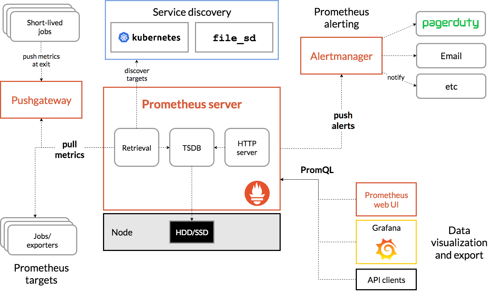
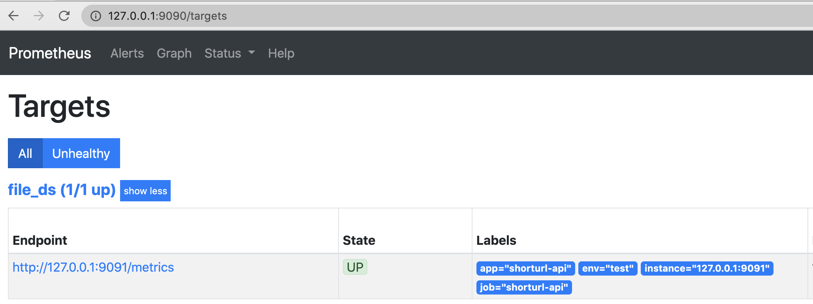
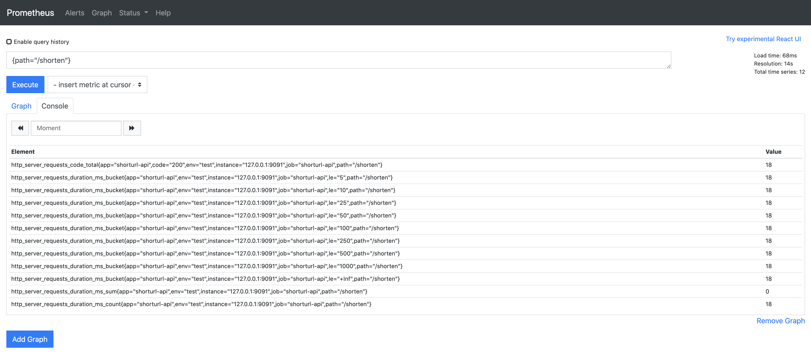
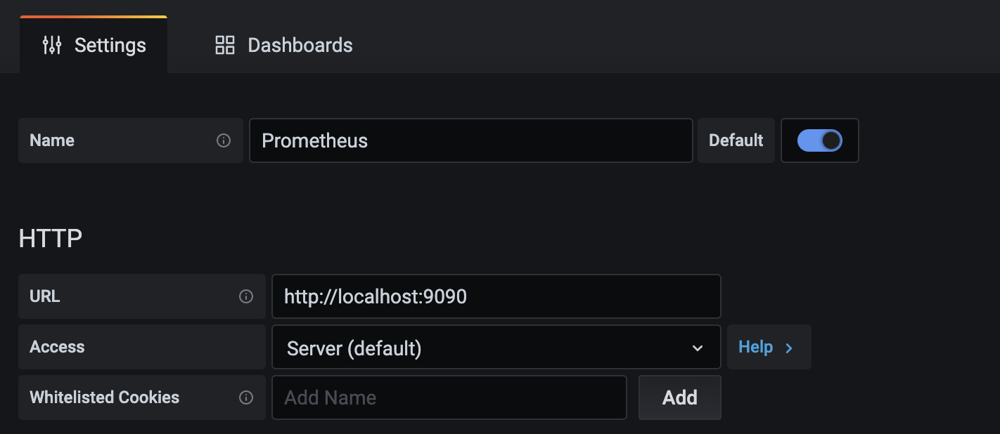
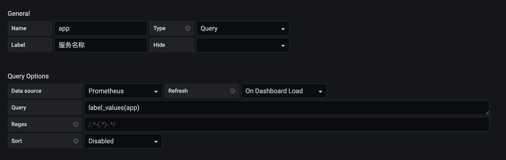
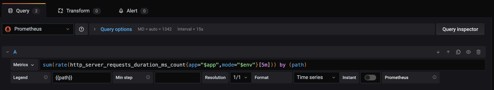
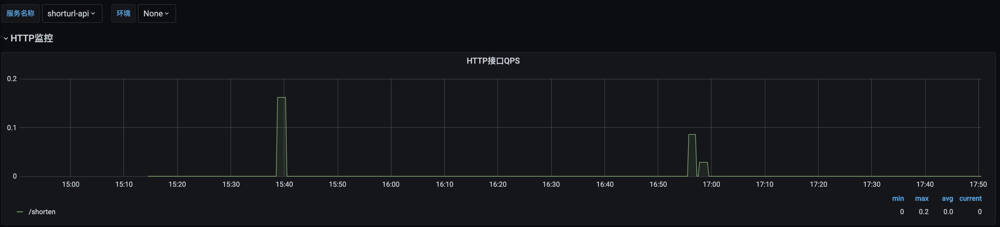

# 基于prometheus的微服务指标监控

服务上线后我们往往需要对服务进行监控，以便能及早发现问题并做针对性的优化，监控又可分为多种形式，比如日志监控，调用链监控，指标监控等等。而通过指标监控能清晰的观察出服务指标的变化趋势，了解服务的运行状态，对于保证服务稳定起着非常重要的作用

[prometheus](https://prometheus.io/)是一个开源的系统监控和告警工具，支持强大的查询语言PromQL允许用户实时选择和汇聚时间序列数据，时间序列数据是服务端通过HTTP协议主动拉取获得，也可以通过中间网关来推送时间序列数据，可以通过静态配置文件或服务发现来获取监控目标

## Prometheus 的架构

Prometheus 的整体架构以及生态系统组件如下图所示：



Prometheus Server直接从监控目标中或者间接通过推送网关来拉取监控指标，它在本地存储所有抓取到样本数据，并对此数据执行一系列规则，以汇总和记录现有数据的新时间序列或生成告警。可以通过 [Grafana](https://grafana.com/) 或者其他工具来实现监控数据的可视化

## go-zero基于prometheus的服务指标监控

[go-zero](https://github.com/tal-tech/go-zero) 框架中集成了基于prometheus的服务指标监控，下面我们通过go-zero官方的示例[shorturl](https://github.com/tal-tech/go-zero/blob/master/doc/shorturl.md)来演示是如何对服务指标进行收集监控的：

- 第一步需要先安装Prometheus，安装步骤请参考[官方文档](https://prometheus.io/)
- go-zero默认不开启prometheus监控，开启方式很简单，只需要在shorturl-api.yaml文件中增加配置如下，其中Host为Prometheus Server地址为必填配置，Port端口不填默认9091，Path为用来拉取指标的路径默认为/metrics

```go
Prometheus:
  Host: 127.0.0.1
  Port: 9091
  Path: /metrics
```

- 编辑prometheus的配置文件prometheus.yml，添加如下配置，并创建targets.json

```go
- job_name: 'file_ds'
    file_sd_configs:
    - files:
      - targets.json
```

- 编辑targets.json文件，其中targets为shorturl配置的目标地址，并添加了几个默认的标签

```go
[
    {
        "targets": ["127.0.0.1:9091"],
        "labels": {
            "job": "shorturl-api",
            "app": "shorturl-api",
            "env": "test",
            "instance": "127.0.0.1:8888"
        }
    }
]
```

- 启动prometheus服务，默认侦听在9090端口

```go
prometheus --config.file=prometheus.yml
```

- 在浏览器输入http://127.0.0.1:9090/，然后点击Status -> Targets即可看到状态为Up的Job，并且Lables栏可以看到我们配置的默认的标签



通过以上几个步骤我们完成了prometheus对shorturl服务的指标监控收集的配置工作，为了演示简单我们进行了手动的配置，在实际的生产环境中一般采用定时更新配置文件或者服务发现的方式来配置监控目标，篇幅有限这里不展开讲解，感兴趣的同学请自行查看相关文档

## go-zero监控的指标类型

go-zero中目前在http的中间件和rpc的拦截器中添加了对请求指标的监控。

主要从请求耗时和请求错误两个维度，请求耗时采用了Histogram指标类型定义了多个Buckets方便进行分位统计，请求错误采用了Counter类型，并在http metric中添加了path标签rpc metric中添加了method标签以便进行细分监控。

接下来演示如何查看监控指标：

首先在命令行多次执行如下命令

```go
curl -i "http://localhost:8888/shorten?url=http://www.xiaoheiban.cn"
```

打开Prometheus切换到Graph界面，在输入框中输入{path="/shorten"}指令，即可查看监控指标，如下图



我们通过PromQL语法查询过滤path为/shorten的指标，结果中显示了指标名以及指标数值，其中http_server_requests_code_total指标中code值为http的状态码，200表明请求成功，http_server_requests_duration_ms_bucket中对不同bucket结果分别进行了统计，还可以看到所有的指标中都添加了我们配置的默认指标

Console界面主要展示了查询的指标结果，Graph界面为我们提供了简单的图形化的展示界面，在实际的生产环境中我们一般使用Grafana做图形化的展示

## grafana可视化界面

[grafana](https://grafana.com/)是一款可视化工具，功能强大，支持多种数据来源Prometheus、Elasticsearch、Graphite等，安装比较简单请参考[官方文档](https://grafana.com/docs/grafana/latest/)，grafana默认端口3000，安装好后再浏览器输入http://localhost:3000/，默认账号和密码都为admin

下面演示如何基于以上指标进行可视化界面的绘制：

- 点击左侧边栏Configuration->Data Source->Add data source进行数据源添加，其中HTTP的URL为数据源的地址



- 点击左侧边栏添加dashboard，然后添加Variables方便针对不同的标签进行过滤筛选比如添加app变量用来过滤不同的服务



- 进入dashboard点击右上角Add panel添加面板，以path维度统计接口的qps



- 最终的效果如下所示，可以通过服务名称过滤不同的服务，面板展示了path为/shorten的qps变化趋势



## 总结

以上演示了go-zero中基于prometheus+grafana服务指标监控的简单流程，生产环境中可以根据实际的场景做不同维度的监控分析。现在go-zero的监控指标主要还是针对http和rpc，这对于服务的整体监控显然还是不足的，比如容器资源的监控，依赖的mysql、redis等资源的监控，以及自定义的指标监控等等，go-zero在这方面后续还会持续优化。希望这篇文章能够给您带来帮助
