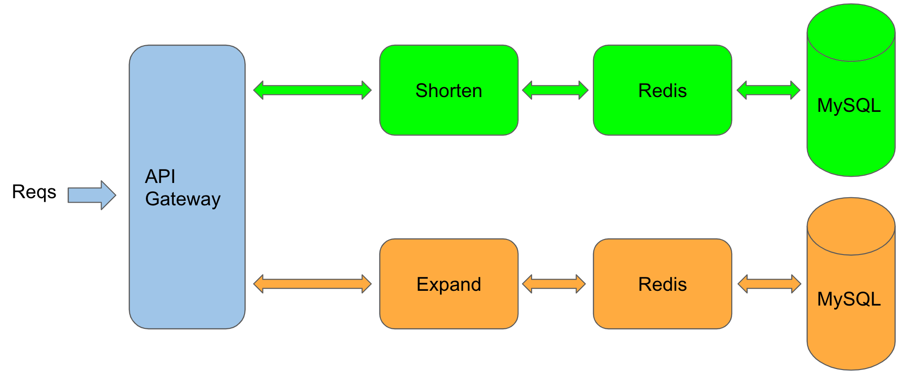

# Rapid development of microservices

English | [简体中文](shorturl.md)

## 0. Why building microservices are so difficult

To build a well working microservice, we need lots of knowledges from different aspects.

* basic functionalities
  1. concurrency control and rate limit, to avoid being brought down by unexpected inbound
  2. service discovery, make sure new or terminated nodes are detected asap
  3. load balancing, balance the traffic base on the throughput of nodes
  4. timeout control, avoid the nodes continue to process the timed out requests
  5. circuit breaker, load shedding, fail fast, protects the failure nodes to recover asap

* advanced functionalities
  1. authorization, make sure users can only access their own data
  2. tracing, to understand the whole system and locate the specific problem quickly
  3. logging, collects data and helps to backtrace problems
  4. observability, no metrics, no optimization

For any point listed above, we need a long article to describe the theory and the implementation. But for us, the developers, it’s very difficult to understand all the concepts and make it happen in our systems. Although, we can use the frameworks that have been well served busy sites. [go-zero](https://github.com/tal-tech/go-zero) is born for this purpose, especially for cloud-native microservice systems.

As well, we always adhere to the idea that **prefer tools over conventions and documents**. We hope to reduce the boilerplate code as much as possible, and let developers focus on developing the business related code. For this purpose, we developed the tool  `goctl`.

Let’s take the shorturl microservice as a quick example to demonstrate how to quickly create microservices by using [go-zero](https://github.com/tal-tech/go-zero). After finishing this tutorial, you’ll find that it’s so easy to write microservices!

## 1. What is a shorturl service

A shorturl service is that it converts a long url into a short one, by well designed algorithms.

Writting this shorturl service is to demonstrate the complete flow of creating a microservice by using go-zero. But algorithms and detail implementations are quite simplified, and this shorturl service is not suitable for production use.

## 2. Architecture of shorturl microservice



* In this tutorial, I only use one rpc service, transform, to demonstrate. It’s not telling that one API Gateway only can call one RPC service, it’s only for simplicity here.
* In production, we should try best to isolate the data belongs to services, that means each service should only use its own database.

## 3. goctl generated code overview

All modules with green background are generated, and will be enabled when necessary. The modules with red background are handwritten code, which is typically business logic code.

* API Gateway

  

* RPC

  

* model

  

And now, let’s walk through the complete flow of quickly create a microservice with go-zero.

## 4. Get started

* install etcd, mysql, redis

* install protoc-gen-go

  ```
  go get -u github.com/golang/protobuf/protoc-gen-go
  ```

* install goctl

  ```shell
  GO111MODULE=on go get -u github.com/tal-tech/go-zero/tools/goctl
  ```

* create the working dir `shorturl` and `shorturl/api`

* in `shorturl` dir, execute `go mod init shorturl` to initialize `go.mod`

## 5. Write code for API Gateway

* use goctl to generate `api/shorturl.api`

  ```shell
  goctl api -o bookstore.api
  ```

  for simplicity, the leading `info` block is removed, and the code looks like:

  ```go
  type (
  	expandReq struct {
  		shorten string `form:"shorten"`
  	}
  
  	expandResp struct {
  		url string `json:"url"`
  	}
  )
  
  type (
  	shortenReq struct {
  		url string `form:"url"`
  	}
  
  	shortenResp struct {
  		shorten string `json:"shorten"`
  	}
  )
  
  service shorturl-api {
  	@server(
  		handler: ShortenHandler
  	)
  	get /shorten(shortenReq) returns(shortenResp)
  
  	@server(
  		handler: ExpandHandler
  	)
  	get /expand(expandReq) returns(expandResp)
  }
  ```

  the usage of `type` keyword is the same as that in go, service is used to define get/post/head/delete api requests, described below:

  * `service shorturl-api {` defines the service name
  * `@server` defines the properties that used in server side
  * `handler` defines the handler name
  * `get /shorten(shortenReq) returns(shortenResp)` defines this is a GET request, the request parameters, and the response parameters

* generate the code for API Gateway by using goctl

  ```shell
  goctl api go -api shorturl.api -dir .
  ```

  the generated file structure looks like:

  ```Plain Text
  .
  ├── api
  │   ├── etc
  │   │   └── shorturl-api.yaml         // configuration file
  │   ├── internal
  │   │   ├── config
  │   │   │   └── config.go             // configuration definition
  │   │   ├── handler
  │   │   │   ├── expandhandler.go      // implements expandHandler
  │   │   │   ├── routes.go             // routes definition
  │   │   │   └── shortenhandler.go     // implements shortenHandler
  │   │   ├── logic
  │   │   │   ├── expandlogic.go        // implements ExpandLogic
  │   │   │   └── shortenlogic.go       // implements ShortenLogic
  │   │   ├── svc
  │   │   │   └── servicecontext.go     // defines ServiceContext
  │   │   └── types
  │   │       └── types.go              // defines request/response
  │   ├── shorturl.api
  │   └── shorturl.go                   // main entrance
  ├── go.mod
  └── go.sum
  ```

* start API Gateway service, listens on port 8888 by default

  ```shell
  go run shorturl.go -f etc/shorturl-api.yaml
  ```

* test API Gateway service

  ```shell
  curl -i "http://localhost:8888/shorten?url=http://www.xiaoheiban.cn"
  ```

  response like:

  ```http
  HTTP/1.1 200 OK
  Content-Type: application/json
  Date: Thu, 27 Aug 2020 14:31:39 GMT
  Content-Length: 15
  
  {"shortUrl":""}
  ```

  You can see that the API Gateway service did nothing except returned a zero value. And let’s implement the business logic in rpc service.

* you can modify `internal/svc/servicecontext.go` to pass dependencies if needed

* implement logic in package `internal/logic`

* you can use goctl to generate code for clients base on the .api file

* till now, the client engineer can work with the api, don’t need to wait for the implementation of server side

## 6. Write code for transform rpc service

- under directory `shorturl` create dir `rpc`

* under directory `rpc/transform` create `transform.proto` file

  ```shell
  goctl rpc template -o transform.proto
  ```
  
  edit the file and make the code looks like:

  ```protobuf
  syntax = "proto3";
  
  package transform;
  
  message expandReq {
      string shorten = 1;
  }
  
  message expandResp {
      string url = 1;
  }
  
  message shortenReq {
      string url = 1;
  }
  
  message shortenResp {
      string shorten = 1;
  }
  
  service transformer {
      rpc expand(expandReq) returns(expandResp);
      rpc shorten(shortenReq) returns(shortenResp);
  }
  ```
  
* use goctl to generate the rpc code, execute the following command in `rpc/transofrm`

  ```shell
  goctl rpc proto -src transform.proto
  ```

  the generated file structure looks like:

  ```Plain Text
  rpc/transform
  ├── etc
  │   └── transform.yaml              // configuration file
  ├── internal
  │   ├── config
  │   │   └── config.go               // configuration definition
  │   ├── logic
  │   │   ├── expandlogic.go          // implements expand logic
  │   │   └── shortenlogic.go         // implements shorten logic
  │   ├── server
  │   │   └── transformerserver.go    // rpc handler
  │   └── svc
  │       └── servicecontext.go       // defines service context, like dependencies
  ├── pb
  │   └── transform.pb.go
  ├── transform.go                    // rpc main entrance
  ├── transform.proto
  └── transformer
      ├── transformer.go              // defines how rpc clients call this service
      ├── transformer_mock.go         // mock file, for test purpose
      └── types.go                    // request/response definition
  ```

  just run it, looks like:

  ```shell
  $ go run transform.go -f etc/transform.yaml
  Starting rpc server at 127.0.0.1:8080...
  ```

  you can change the listening port in file `etc/transform.yaml`.

## 7. Modify API Gateway to call transform rpc service

* modify the configuration file `shorturl-api.yaml`, add the following:

  ```yaml
  Transform:
    Etcd:
      Hosts:
        - localhost:2379
      Key: transform.rpc
  ```

  automatically discover the transform service by using etcd.

* modify the file `internal/config/config.go`, add dependency on transform service:

  ```go
  type Config struct {
  	rest.RestConf
  	Transform zrpc.RpcClientConf     // manual code
  }
  ```

* modify the file `internal/svc/servicecontext.go`, like below:

  ```go
  type ServiceContext struct {
  	Config    config.Config
  	Transformer transformer.Transformer  // manual code
  }
  
  func NewServiceContext(c config.Config) *ServiceContext {
  	return &ServiceContext{
  		Config:    c,
      Transformer: transformer.NewTransformer(zrpc.MustNewClient(c.Transform)), // manual code
  	}
  }
  ```

  passing the dependencies among services within ServiceContext.

* modify the method `Expand` in the file `internal/logic/expandlogic.go`, looks like:

  ```go
  func (l *ExpandLogic) Expand(req types.ExpandReq) (*types.ExpandResp, error) {
    // manual code start
  	resp, err := l.svcCtx.Transformer.Expand(l.ctx, &transformer.ExpandReq{
  		Shorten: req.Shorten,
  	})
  	if err != nil {
  		return nil, err
  	}
  
  	return &types.ExpandResp{
  		Url: resp.Url,
  	}, nil
    // manual code stop
  }
  ```
  
  by calling the method `Expand` of `transformer` to restore the shortened url.
  
* modify the file `internal/logic/shortenlogic.go`, looks like:

  ```go
  func (l *ShortenLogic) Shorten(req types.ShortenReq) (*types.ShortenResp, error) {
    // manual code start
  	resp, err := l.svcCtx.Transformer.Shorten(l.ctx, &transformer.ShortenReq{
  		Url: req.Url,
  	})
  	if err != nil {
  		return nil, err
  	}
  
  	return &types.ShortenResp{
  		Shorten: resp.Shorten,
  	}, nil
    // manual code stop
  }
  ```

  by calling the method `Shorten` of `transformer` to shorten the url.

Till now, we’ve done the modification of API Gateway. All the manually added code are marked.

## 8. Define the database schema, generate the code for CRUD+cache

* under shorturl, create the directory `rpc/transform/model`: `mkdir -p rpc/transform/model`

* under the directory rpc/transform/model create the file called shorturl.sql`, contents as below:

  ```sql
  CREATE TABLE `shorturl`
  (
    `shorten` varchar(255) NOT NULL COMMENT 'shorten key',
    `url` varchar(255) NOT NULL COMMENT 'original url',
    PRIMARY KEY(`shorten`)
  ) ENGINE=InnoDB DEFAULT CHARSET=utf8mb4;
  ```

* create DB and table

  ```sql
  create database gozero;
  ```

  ```sql
  source shorturl.sql;
  ```

* under the directory `rpc/transform/model` execute the following command to genrate CRUD+cache code, `-c` means using `redis cache`

  ```shell
  goctl model mysql ddl -c -src shorturl.sql -dir .
  ```

  you can also generate the code from the database url by using `datasource` subcommand instead of `ddl`

  the generated file structure looks like:

  ```Plain Text
  rpc/transform/model
  ├── shorturl.sql
  ├── shorturlmodel.go              // CRUD+cache code
  └── vars.go                       // const and var definition
  ```

## 9. Modify shorten/expand rpc to call crud+cache

* modify `rpc/transform/etc/transform.yaml`, add the following:

  ```yaml
  DataSource: root:@tcp(localhost:3306)/gozero
  Table: shorturl
  Cache:
    - Host: localhost:6379
  ```

  you can use multiple redis as cache. redis node and cluster are both supported.

* modify `rpc/transform/internal/config.go`, like below:

  ```go
  type Config struct {
  	zrpc.RpcServerConf
  	DataSource string             // manual code
  	Table      string             // manual code
  	Cache      cache.CacheConf    // manual code
  }
  ```

  added the configuration for mysql and redis cache.

* modify `rpc/transform/internal/svc/servicecontext.go`, like below:

  ```go
  type ServiceContext struct {
  	c     config.Config
    Model *model.ShorturlModel   // manual code
  }
  
  func NewServiceContext(c config.Config) *ServiceContext {
  	return &ServiceContext{
  		c:             c,
  		Model: model.NewShorturlModel(sqlx.NewMysql(c.DataSource), c.Cache, c.Table), // manual code
  	}
  }
  ```

* modify `rpc/transform/internal/logic/expandlogic.go`, like below:

  ```go
  func (l *ExpandLogic) Expand(in *transform.ExpandReq) (*transform.ExpandResp, error) {
  	// manual code start
  	res, err := l.svcCtx.Model.FindOne(in.Shorten)
  	if err != nil {
  		return nil, err
  	}
  
  	return &transform.ExpandResp{
  		Url: res.Url,
  	}, nil
  	// manual code stop
  }
  ```

* modify `rpc/shorten/internal/logic/shortenlogic.go`, looks like:

  ```go
  func (l *ShortenLogic) Shorten(in *transform.ShortenReq) (*transform.ShortenResp, error) {
    // manual code start, generates shorturl
  	key := hash.Md5Hex([]byte(in.Url))[:6]
  	_, err := l.svcCtx.Model.Insert(model.Shorturl{
  		Shorten: key,
  		Url:     in.Url,
  	})
  	if err != nil {
  		return nil, err
  	}
  
  	return &transform.ShortenResp{
  		Shorten: key,
  	}, nil
    // manual code stop
  }
  ```

  till now, we finished modifing the code, all the modified code is marked.

## 10. Call shorten and expand services

* call shorten api

  ```shell
  curl -i "http://localhost:8888/shorten?url=http://www.xiaoheiban.cn"
  ```

  response like:

  ```http
  HTTP/1.1 200 OK
  Content-Type: application/json
  Date: Sat, 29 Aug 2020 10:49:49 GMT
  Content-Length: 21
  
  {"shorten":"f35b2a"}
  ```

* call expand api

  ```shell
  curl -i "http://localhost:8888/expand?shorten=f35b2a"
  ```

  response like:

  ```http
  HTTP/1.1 200 OK
  Content-Type: application/json
  Date: Sat, 29 Aug 2020 10:51:53 GMT
  Content-Length: 34
  
  {"url":"http://www.xiaoheiban.cn"}
  ```

## 11. Benchmark

Because benchmarking the write requests depends on the write throughput of mysql, we only benchmarked the expand api. We read the data from mysql and cache it in redis. I chose 100 hot keys hardcoded in shorten.lua to generate the benchmark.


as shown above, in my MacBook Pro, the QPS is like 30K+.

## 12. Full code

[https://github.com/tal-tech/go-zero/tree/master/example/shorturl](https://github.com/tal-tech/go-zero/tree/master/example/shorturl)

## 13. Conclusion

We always adhere to **prefer tools over conventions and documents**.

go-zero is not only a framework, but also a tool to simplify and standardize the building of micoservice systems.

We not only keep the framework simple, but also encapsulate the complexity into the framework. And the developers are free from building the difficult and boilerplate code. Then we get the rapid development and less failure.

For the generated code by goctl, lots of microservice components are included, like concurrency control, adaptive circuit breaker, adaptive load shedding, auto cache control etc. And it’s easy to deal with the busy sites.

If you have any ideas that can help us to improve the productivity, tell me any time! 👏
