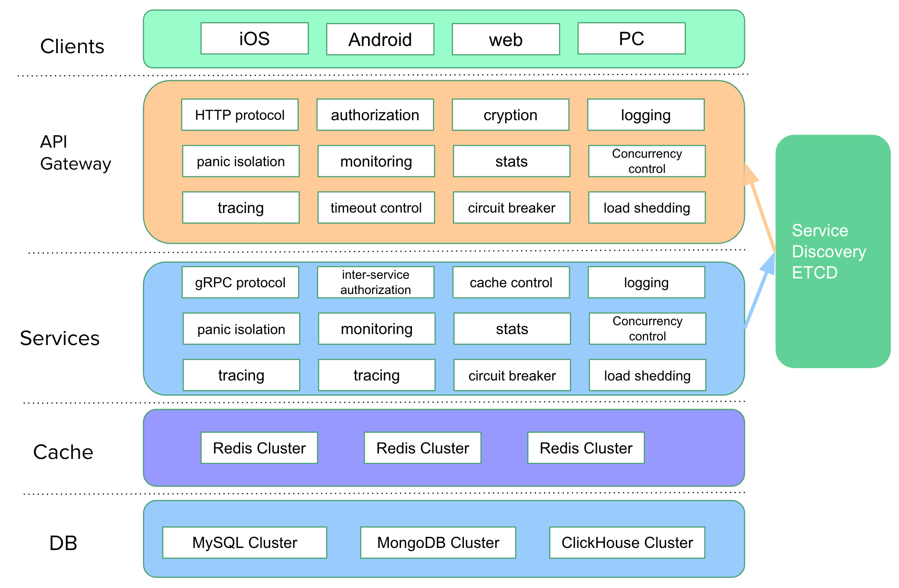
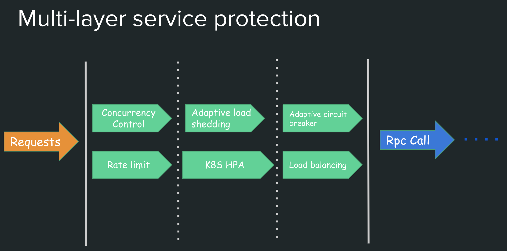

# go-zero

English | [简体中文](readme.md)

[](https://github.com/tal-tech/go-zero/actions)
[](https://codecov.io/gh/tal-tech/go-zero)
[](https://goreportcard.com/report/github.com/tal-tech/go-zero)
[](https://github.com/tal-tech/go-zero)
[](https://opensource.org/licenses/MIT)

## 0. what is go-zero

go-zero is a web and rpc framework that with lots of engineering practices builtin. It’s born to ensure the stability of the busy services with resilience design, and has been serving sites with tens of millions users for years.

go-zero contains simple API description syntax and code generation tool called `goctl`. You can generate Go, iOS, Android, Kotlin, Dart, TypeScript, JavaScript from .api files with `goctl`.

Advantages of go-zero:

* improve the stability of the services with tens of millions of daily active users
* builtin chained timeout control, concurrency control, rate limit, adaptive circuit breaker, adaptive load shedding, even no configuration needed
* builtin middlewares also can be integrated into your frameworks
* simple API syntax, one command to generate couple of different languages
* auto validate the request parameters from clients
* plenty of builtin microservice management and concurrent toolkits



## 1. Backgrounds of go-zero

At the beginning of 2018, we heavily suffered from frequent downtime. We decided to re-design our system, from monolithic architecture with Java+MongoDB to microservice architecture. After researches and comparison, we chose to:

* Golang based
  * great performance
  * simple syntax
  * proven engineering efficiency
  * extreme deployment experience
  * less server resource consumption
* Self-designed microservice architecture
  * I have rich experience on designing microservice architectures
  * easy to location the problems
  * easy to extend the features

## 2. Design considerations on go-zero

By designing the microservice architecture, we expected to ensure the stability, as well as the productivity. And from just the beginning, we have the following design principles:

* keep it simple
* high availability
* stable on high concurrency
* easy to extend
* resilience design, failure-oriented programming
* try best to be friendly to the business logic development, encapsulate the complexity
* one thing, one way

After almost half a year, we finished the transfer from monolithic system to microservice system, and deployed on August 2018. The new system guaranteed the business growth, and the system stability.

## 3. The implementation and features of go-zero

go-zero is a web and rpc framework that integrates lots of engineering practices. The features are mainly listed below:

* powerful tool included, less code to write
* simple interfaces
* fully compatible with net/http
* middlewares are supported, easy to extend
* high performance
* failure-oriented programming, resilience design
* builtin service discovery, load balancing
* builtin concurrency control, adaptive circuit breaker, adaptive load shedding, auto trigger, auto recover
* auto validation of API request parameters
* chained timeout control
* auto management of data caching
* call tracing, metrics and monitoring
* high concurrency protected

As below, go-zero protects the system with couple layers and mechanisms:



## 4. Future development plans of go-zero

* auto generate API mock server, make the client debugging easier
* auto generate the simple integration test for the server side just from the .api files

## 5. Installation

Run the following command under your project:

```shell
go get -u github.com/tal-tech/go-zero
```

## 6. Quick Start

0. full examples can be checked out from below:

     [Rapid development of microservice systems](doc/shorturl-en.md)

     [Rapid development of microservice systems - multiple RPCs](doc/bookstore-en.md)

1. install goctl

   `goctl`can be read as `go control`. `goctl` means not to be controlled by code, instead, we control it. The inside `go` is not `golang`. At the very beginning, I was expecting it to help us improve the productivity, and make our lives easier.

   ```shell
   GO111MODULE=on go get -u github.com/tal-tech/go-zero/tools/goctl
   ```

   make sure goctl is executable.

2. create the API file, like greet.api, you can install the plugin of goctl in vs code, api syntax is supported.

   ```go
   type Request struct {
     Name string `path:"name,options=you|me"` // parameters are auto validated
   }

   type Response struct {
     Message string `json:"message"`
   }

   service greet-api {
     @server(
       handler: GreetHandler
     )
     get /greet/from/:name(Request) returns (Response);
   }
   ```

   the .api files also can be generate by goctl, like below:

   ```shell
   goctl api -o greet.api
   ```

3. generate the go server side code

   ```shell
   goctl api go -api greet.api -dir greet
   ```

   the generated files look like:

   ```Plain Text
   ├── greet
   │   ├── etc
   │   │   └── greet-api.yaml        // configuration file
   │   ├── greet.go                  // main file
   │   └── internal
   │       ├── config
   │       │   └── config.go         // configuration definition
   │       ├── handler
   │       │   ├── greethandler.go   // get/put/post/delete routes are defined here
   │       │   └── routes.go         // routes list
   │       ├── logic
   │       │   └── greetlogic.go     // request logic can be written here
   │       ├── svc
   │       │   └── servicecontext.go // service context, mysql/redis can be passed in here
   │       └── types
   │           └── types.go          // request/response defined here
   └── greet.api                     // api description file
   ```

   the generated code can be run directly:

   ```shell
     cd greet
     go run greet.go -f etc/greet-api.yaml
   ```

   by default, it’s listening on port 8888, while it can be changed in configuration file.

   you can check it by curl:

   ```shell
   curl -i http://localhost:8888/greet/from/you
   ```

   the response looks like:

   ```http
   HTTP/1.1 200 OK
   Date: Sun, 30 Aug 2020 15:32:35 GMT
   Content-Length: 0
   ```

4. Write the business logic code

    * the dependencies can be passed into the logic within servicecontext.go, like mysql, reds etc.
    * add the logic code in logic package according to .api file

5. Generate code like Java, TypeScript, Dart, JavaScript etc. just from the api file

   ```shell
   goctl api java -api greet.api -dir greet
   goctl api dart -api greet.api -dir greet
   ...
   ```

## 7. Benchmark


[Checkout the test code](https://github.com/smallnest/go-web-framework-benchmark)

## 8. Documents (adding)

* [Rapid development of microservice systems](doc/shorturl-en.md)
* [Rapid development of microservice systems - multiple RPCs](doc/bookstore-en.md)
