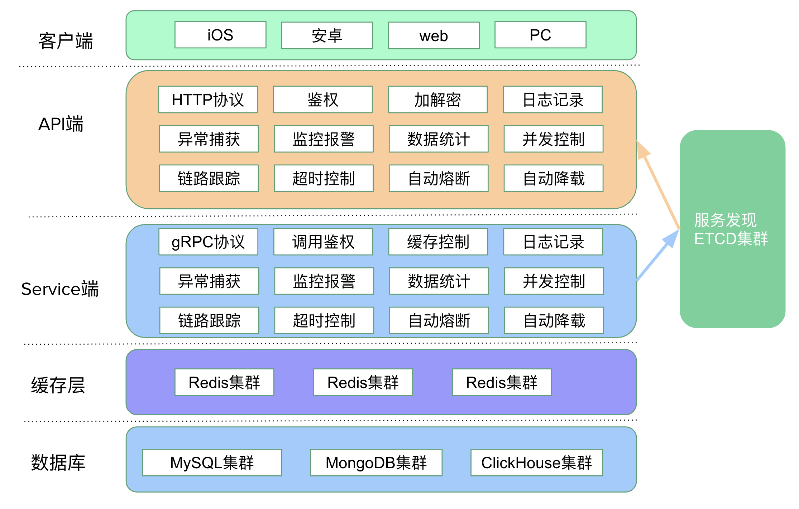
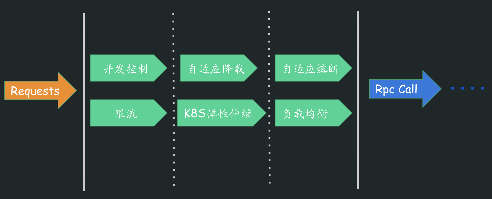
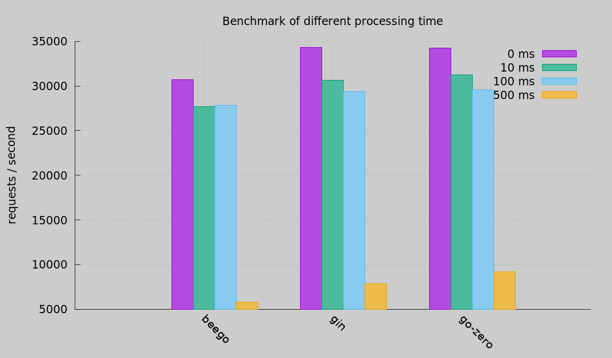

# go-zero

[English](readme-en.md) | 简体中文

[](https://github.com/tal-tech/go-zero/actions)
[](https://codecov.io/gh/tal-tech/go-zero)
[](https://goreportcard.com/report/github.com/tal-tech/go-zero)
[](https://github.com/tal-tech/go-zero)
[](https://opensource.org/licenses/MIT)

## 0. go-zero介绍

go-zero是一个集成了各种工程实践的web和rpc框架。通过弹性设计保障了大并发服务端的稳定性，经受了充分的实战检验。

go-zero 包含极简的 API 定义和生成工具 goctl，可以根据定义的 api 文件一键生成 Go, iOS, Android, Kotlin, Dart, TypeScript, JavaScript 代码，并可直接运行。

使用go-zero的好处：

* 轻松获得支撑千万日活服务的稳定性
* 内建级联超时控制、限流、自适应熔断、自适应降载等微服务治理能力，无需配置和额外代码
* 微服务治理中间件可无缝集成到其它现有框架使用
* 极简的API描述，一键生成各端代码
* 自动校验客户端请求参数合法性
* 大量微服务治理和并发工具包



## 1. go-zero框架背景

18年初，晓黑板后端在经过频繁的宕机后，决定从`Java+MongoDB`的单体架构迁移到微服务架构，经过仔细思考和对比，我们决定：

* 基于Go语言
  * 高效的性能
  * 简洁的语法
  * 广泛验证的工程效率
  * 极致的部署体验
  * 极低的服务端资源成本
* 自研微服务框架
  * 个人有过很多微服务框架自研经验
  * 需要有更快速的问题定位能力
  * 更便捷的增加新特性

## 2. go-zero框架设计思考

对于微服务框架的设计，我们期望保障微服务稳定性的同时，也要特别注重研发效率。所以设计之初，我们就有如下一些准则：

* 保持简单
* 高可用
* 高并发
* 易扩展
* 弹性设计，面向故障编程
* 尽可能对业务开发友好，封装复杂度
* 尽可能约束做一件事只有一种方式

我们经历不到半年时间，彻底完成了从`Java+MongoDB`到`Golang+MySQL`为主的微服务体系迁移，并于18年8月底完全上线，稳定保障了晓黑板后续增长，确保了整个服务的高可用。

## 3. go-zero项目实现和特点

go-zero是一个集成了各种工程实践的包含web和rpc框架，有如下主要特点：

* 强大的工具支持，尽可能少的代码编写
* 极简的接口
* 完全兼容net/http
* 支持中间件，方便扩展
* 高性能
* 面向故障编程，弹性设计
* 内建服务发现、负载均衡
* 内建限流、熔断、降载，且自动触发，自动恢复
* API参数自动校验
* 超时级联控制
* 自动缓存控制
* 链路跟踪、统计报警等
* 高并发支撑，稳定保障了晓黑板疫情期间每天的流量洪峰

如下图，我们从多个层面保障了整体服务的高可用：



## 4. go-zero近期开发计划

* 自动生成API mock server，便于客户端开发
* 自动生成服务端功能测试

## 5. Installation

在项目目录下通过如下命令安装：

```shell
go get -u github.com/tal-tech/go-zero
```

## 6. Quick Start

0. 完整示例请查看

    [快速构建高并发微服务](doc/shorturl.md)

    [快速构建高并发微服务-多RPC版](doc/bookstore.md)

1. 安装goctl工具

   `goctl`读作`go control`，不要读成`go C-T-L`。`goctl`的意思是不要被代码控制，而是要去控制它。其中的`go`不是指`golang`。在设计`goctl`之初，我就希望通过`她`来解放我们的双手👈

   ```shell
   GO111MODULE=on GOPROXY=https://goproxy.cn/,direct go get -u github.com/tal-tech/go-zero/tools/goctl
   ```

   确保goctl可执行

2. 快速生成api服务

   ```shell
      goctl api new greet
      cd greet
      go run greet.go -f etc/greet-api.yaml
   ```

      默认侦听在8888端口（可以在配置文件里修改），可以通过curl请求：

   ```shell
      curl -i http://localhost:8888/greet/from/you
   ```

      返回如下：

   ```http
      HTTP/1.1 200 OK
      Date: Sun, 30 Aug 2020 15:32:35 GMT
      Content-Length: 0
   ```

      编写业务代码：

      * api文件定义了服务对外暴露的路由，可参考[api规范](https://github.com/tal-tech/go-zero/blob/master/doc/goctl.md)
      * 可以在servicecontext.go里面传递依赖给logic，比如mysql, redis等
      * 在api定义的get/post/put/delete等请求对应的logic里增加业务处理逻辑

3. 可以根据api文件生成前端需要的Java, TypeScript, Dart, JavaScript代码

      ```shell
      goctl api java -api greet.api -dir greet
      goctl api dart -api greet.api -dir greet
      ...
      ```

## 7. Benchmark



[测试代码见这里](https://github.com/smallnest/go-web-framework-benchmark)

## 8. 文档

* API文档 (逐步完善中)

  [https://www.yuque.com/tal-tech/go-zero](https://www.yuque.com/tal-tech/go-zero)

* awesome系列
  * [快速构建高并发微服务](doc/shorturl.md)
  * [快速构建高并发微服务-多RPC版](doc/bookstore.md)
  * [goctl使用帮助](doc/goctl.md)
  * [通过MapReduce降低服务响应时间](doc/mapreduce.md)
  * [关键字替换和敏感词过滤工具](doc/keywords.md)
  * [进程内缓存使用方法](doc/collection.md)
  * [防止缓存击穿之进程内共享调用](doc/sharedcalls.md)
  * [基于prometheus的微服务指标监控](doc/metric.md)
  * [文本序列化和反序列化](doc/mapping.md)
  * [快速构建jwt鉴权认证](doc/jwt.md)

## 9. 微信交流群


